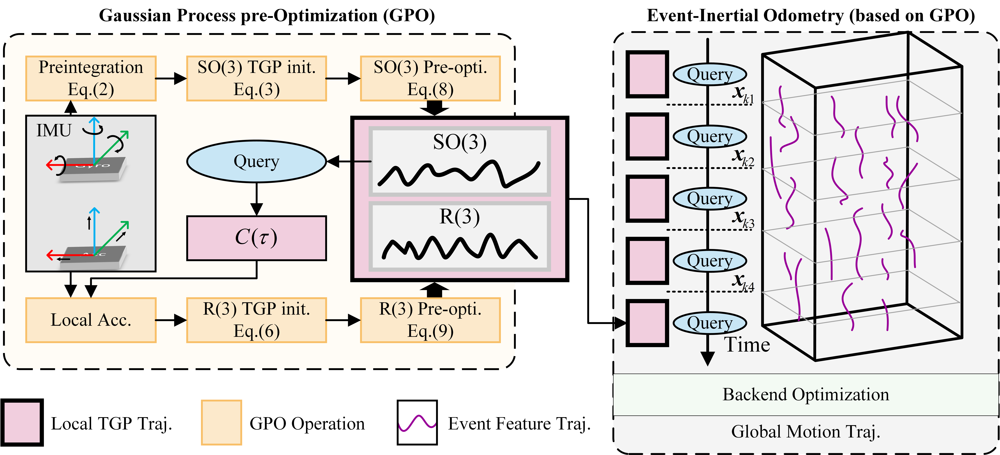

<h1 align="center">Continuous Gaussian Process Pre-Optimization for Asynchronous Event-Inertial Odometry</h1>

<p align="center">
    <a>Zhixiang Wang</a><sup>1,2</sup> &emsp;&emsp;
    <a>Xudong Li</a><sup>1,2</sup> &emsp;&emsp;
    <a>Yizhai Zhang</a><sup>1,2*</sup> &emsp;&emsp;
    <a>Fan Zhang</a><sup>1,2</sup> &emsp;&emsp;
    <a>Panfeng Huang</a><sup>1,2</sup>
</p>

<p align="center">
    <sup>1</sup>Northwestern Polytechnical University, <sup>2</sup>Research Center for Intelligent Robotics
</p>

<p align="center">
    <sup>*</sup>Corresponding Author
</p>

<div align="center">
  
</div>

<h3 align="center">
  <a href="https://arxiv.org/abs/2412.08909">Paper</a> 
  | <a href="">Video</a> 
  </h3>

## Abstract
Event cameras, as bio-inspired sensors, are asynchronously triggered with high-temporal resolution compared to intensity cameras. Recent work has focused on fusing the event measurements with inertial measurements to enable ego-motion estimation in high-speed and HDR environments. However, existing methods predominantly rely on IMU preintegration designed mainly for synchronous sensors and discrete-time frameworks. In this paper, we propose GPO, **a continuous-time preintegration framework that can efficiently achieve tightly-coupled fusion of fully asynchronous sensors**. Concretely, we model the preintegration as two local Temporal Gaussian Process (TGP) trajectories and leverage a light-weight two-step optimization to infer the continuous preintegration pseudo-measurements. We show that the Jacobians of arbitrary queried states can be naturally propagated using our framework, which enables GPO to be involved in the asynchronous fusion. Our method realizes a linear and constant time cost for optimization and query, respectively. To further validate the proposal, we leverage GPO to design an asynchronous event-inertial odometry and compare with other asynchronous fusion schemes. Experiments conducted on both public and own-collected datasets demonstrate that the proposed GPO offers significant advantages in terms of accuracy and efficiency, outperforming existing approaches in handling asynchronous sensor fusion.

## Features
- ✅ Continuous-time preintegration framework
- ✅ Tightly-coupled fusion of asynchronous sensors
- ✅ Efficient for query and optimization
- ✅ Natural propagation of Jacobians of arbitrary queried states

## Updates
- [x] Paper
- [x] Video Demo
- [ ] Core Algorithm Implementation
- [ ] Event-inertial Odometry Integration


## Citation
If you find this work useful, please cite our paper:

```bib
@article{wang2024continuous,
  title={Continuous Gaussian Process Pre-Optimization for Asynchronous Event-Inertial Odometry},
  author={Wang, Zhixiang and Li, Xudong and Zhang, Yizhai and Zhang, Fan and Huang, Panfeng},
  journal={arXiv preprint arXiv:2412.08909},
  year={2024}
}
```
